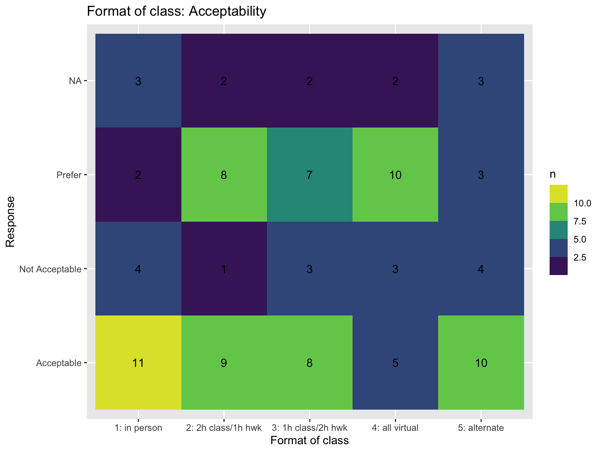
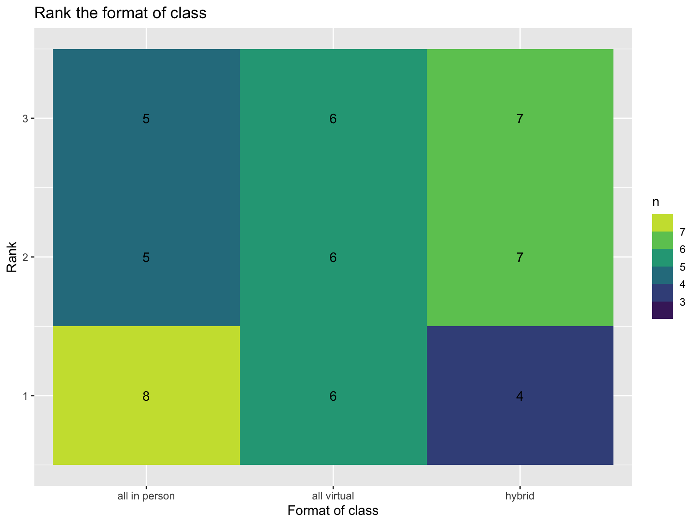

```{r xaringan-themer, include = FALSE}
library(xaringanthemer)
style_mono_accent(
  base_color = "midnightblue",
  header_font_google = google_font("Josefin Sans"),
  link_color = "steelblue",
  text_font_size = "26px",
  footnote_font_size = "22px"
)
```

```{r xaringanExtra, echo=FALSE}
xaringanExtra::use_xaringan_extra(c("tile_view", "logo", "tachyons"))
xaringanExtra::use_panelset()
xaringanExtra::use_tachyons()
```

```{r setup, include=FALSE}
options(htmltools.dir.version = FALSE)
```

class: center, middle

# Welcome

---

# Jessica Minnier, PhD

- Associate Professor, Biostatistics, OHSU-PSU School of Public Health
- Knight Cancer Institute Biostatistics Shared Resource
- Co-instructor of many OCTRI BERD [R Workshops](https://github.com/jminnier/berd_r_courses)
- Co-founder of [Cascadia-R Conference](https://cascadiarconf.com)
- I am not a programmer (CS minor does not count, believe me)! I learned R in graduate school in 2007.

---
# Class Facilitator/TA

- Meet Brad
- He will be helping during class answer questions and troubleshoot
- Also will be grading and will be available for questions on Slack

---
# Introduction Overview

- Code of Conduct
- Introduction to Zoom
- Learning Objectives
- Class Logistics

---
# About this course

- This is a new-ish course
- Winter 2021 version developed and taught by [Ted Laderas](https://laderast.github.io/)
- I taught virtually 2022
- Previous materials (and videos) are available on last year's course website https://sph-r-programming.netlify-2022.app/

Previous experience survey results:
- ~10% of you have never used R, ~60% have used R in a previous class

---
class:center, middle
# Class Format


---

# Survey results



---

# Survey results



---

# Conclusion

We will try 2 hours in class instruction and ~1 hour recorded videos (assigned by Thursday to be watched before the next class Wednesday).

I already had a hard time fitting in everything in 3 hours virtual class last year, so we will try this out for a while. Feedback welcome on the post-class survey.

---
# Zoom Recordings/Attendance

- Class is in person, likely about 2 hours of in person time (instruction and exercises on your own) with 1 hour video recordings to watch outside of class
- I will try to record each session and will post it as soon it is ready
- You can log into zoom live, if you wish. You might need to unmute yourself to get my attention to ask questions.
- Zoom link is on sakai and outlook invite

---
class:center, middle
# This is a Safe Space to Ask Questions

---
# Code of Conduct

This class is governed by the [BioData Club Code of Conduct](https://biodata-club.github.io/code_of_conduct/) and the [OHSU Code of Conduct](https://www.ohsu.edu/integrity-department/code-conduct).

This class is meant to be a psychologically safe space where it's ok to ask questions.

I want to normalize your own curiosity and fuel your desire to learn more.

If you are disruptive to class learning or disparaging to other students, I may mute you for the day.

---
# Code of Conduct Violations

Please report them to me directly or to our TA if you feel comfortable.

If not, please use the anonymous reporting form here: https://forms.gle/yAAGx7bkZYhgsdqVA


# Learning Objectives

By the end of this course you will be able to:

1. **Understand** and **utilize** **R/RStudio** (hopefully with minimal pain).
2. **Understand** basic data types and data structures in R.
3. **Familiarize** and **load** data files (Excel, Comma Separated Value files) into R/Rstudio, with tips on formatting.
4. **Visualize** datasets using **ggplot2** and understand how to build basic plots using **ggplot2** syntax.
5. **Filter** and **format** data in R for use with various routines.
6. **Execute** and **Interpret** some basic statistics in R.
7. **Automate** repetitive tasks in R, such as loading a folder of files.

*__If time allows (perhaps one or two of these)__*:

We may explore fancy tables in our R markdown reports with `gt`, or Bioconductor Data Structures, or machine learning workflows using `tidymodels`, or basic interactive applications with `shiny`.


---
# Words of Encouragement

Programming *is* for everyone who is motivated to learn, and willing to keep trying.

[You can do it! (It ~~might~~ will be hard and frustrating at times.)](https://sph-r-programming-2023.netlify.app/syllabus/#words-of-encouragement)


---
class: center, middle
# Class Logistics

---
class: center, middle

# Let's look at the website:

## http://sph-r-programming-2023.netlify.com

---
# Caveat Emptor

- This is *not* a conventional programming course
- We try to get you doing interesting and useful things from the beginning
- We use `tidyverse` because it helps you get up and running quickly
- This is also *not* a full course on statistics or machine learning

---
# Textbooks

All textbooks are available online and are free to use.

We'll be using the following for reference:

**R for Data Science**. Garret Grolemund and Hadley Wickham. <https://r4ds.had.co.nz/>

**Getting Used to R, RStudio, and RMarkdown**. Chester Ismay.
<https://ismayc.github.io/rbasics-book/>

**Data Science: A First Introduction**. Tiffany Timbers, Trevor Campbell, Melissa Lee. <https://datasciencebook.ca/>

**RMarkdown for Scientists**. Nick Tierney. <https://rmd4sci.njtierney.com/>

**Statistical Inference via Data Science: A ModernDive into R and the Tidyverse*. Chester Ismay and Albert Y. Kim. <https://moderndive.com/>

**Advanced R**. Hadley Wickham. <https://adv-r.hadley.nz/>


---
# My Approach to Teaching

(aka Dr. Laderas' approach, also my approach)

I think students learn the best when they're actually looking and thinking about data.

This means we will be looking at lots of data.

---
# Social Learning Works

I also think that we learn best when we are discussing data together.

We will be working on activities in class. Please discuss the problem together, look at each other's code, explain it to each other. 

---
# Format of Class

- Review of muddiest points (10-15 minutes)
- Function of the Week presentations (20 minutes)
- Main Learning (2 hours)
- Wrap Up/Questions (remaining time)

We'll take 5 minute breaks at the top of each hour.

---
# Syllabus

There is a syllabus on the [website](https://sph-r-programming-2023.netlify.app/syllabus/), as well as on [Sakai](https://sakai.ohsu.edu/portal/site/BSTA-504-1-22151-W22/page/73c051e0-0b37-4956-853a-95ced6138d53). Let me know if you notice discrepancies.

---
# Grading Breakdown

- Attendance 5% (see next slide)
- Midterm Project 20%
- Function of the Week 10% (Rmd/html + 5 min. presentation)
- Homework Assignments 45%
- Final Project 20%

---
# Class Attendance Policy & Post-class Survey

Please try to attend class. 

There is a post-class survey that will be posted. Please fill it out, as it counts as attendance. You only need to fill out 5 out of 11 of the surveys. Any more than that will be counted as extra credit. Mostly this helps me know how the class is going.

If you can't attend, please log in to zoom or watch the recordings and then fill out the survey.

- Clearest Point: What was the most clear part of the lecture?
- Muddiest Point: What was the most unclear part of the lecture to you?
- Anything Else: Is there something you’d like me to know?

https://forms.gle/PA1CH7gTgrKWkmzw6

---
# Class Assignments

Class Assignments will be done in R Markdown documents. 

Assignments will be submitted through Sakai. 

We will do our best to return it to you within a week.

We will highlight any points of confusion.

---
# Function of the Week

- Starts in Week 4
- Learn and share about a lesser known `tidyverse()` function (5 minute presentation)
- Share your experience with the function
  - Is it useful?
  - Is it hard to use?
  - Share an example
  
---
# Midterm / Final Project

- Midterm: Pick a dataset and show that you can explore it, plot it, and transform it to answer a specific question
  - Schedule a meeting to discuss the data
- Final: I will choose a data set and assign tasks related to what we have learned.

---
# Class Slack

- Invitation to our Slack channel is on Sakai
- Use to ask questions
- If you know the answer, try to help out
- I will try and review once a day
- Video channels for working together

---
# Office Hours

I will be available for office hours by appointment. Use the calendly link on sakai to request a meeting with me (I will try to keep availability updated, but sometimes I make mistakes).


---
# Why R?

R is an extremely powerful language for **statistical modeling**, **machine learning**, **data manipulation**, and **visualization**.

It's a *hub* language in that you can access many different kinds of systems (TensorFlow, Databases, Apache Spark) without needing to know other languages.

---
# R is Not Easy

- Learning R can be a difficult, but rewarding process
- Be patient with yourself, don't beat yourself up
- We'll try to make it a fun process for you

---
# R and RStudio

- Last year this course used [RStudio.cloud](http://rstudio.cloud), but for various reasons we're going to try using our own computers and Rstudio desktop.
- Or, if you prefer, PSU students have access to a [virtual environment (VLAB)](https://www.pdx.edu/technology/vlab) that has Rstudio on it.

---
# Other Resources/Events (Optional)

- [OCTRI BERD R Workshops](https://github.com/jminnier/berd_r_courses)
- [PDX R User Group Meetup](https://www.meetup.com/portland-r-user-group/) (monthly)
- [BioData Club](https://biodata-club.github.io/)
- [Cascadia R Conference](https://cascadiarconf.com/) in late May or early June

---
class: center, middle

# Any Questions?